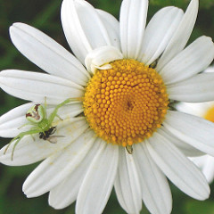
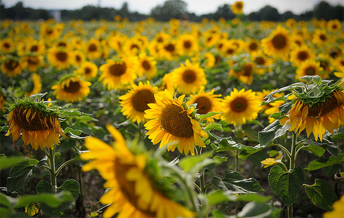

# 🌸 Flower Classification using Deep Learning

## 📖 Project Overview

This project focuses on developing an intelligent flower classification system using Deep Learning and Computer Vision techniques. The model is trained to recognize and classify flower images into five different categories: Daisy, Dandelion, Rose, Sunflower, and Tulip.

By leveraging Convolutional Neural Networks (CNNs), the system automatically learns visual features such as petal patterns, color variations, and flower structures to accurately identify flower species.

The model learns visual features such as petal structure, color patterns, texture, and flower shape to accurately identify flower species from images.

---

## 🎯 Project Objective

The primary objective of this project is to build an automated flower recognition system capable of classifying flower species from images with high accuracy. This project demonstrates the practical implementation of Deep Learning concepts such as image preprocessing, data augmentation, model training, evaluation, and prediction.

---

## 🌺 Dataset

The dataset consists of flower images belonging to five categories:

| Class |
|---------|
| Daisy |
| Dandelion |
| Rose |
| Sunflower |
| Tulip |

### Dataset Structure

```text
Flower-Classification-using-Deep-Learning/
│
├── images/
│   ├── Daisy1.jpg
│   ├── Daisy2.jpg
│   ├── Dandelion1.jpg
│   ├── Dandelion2.jpg
│   ├── Rose1.jpg
│   ├── Rose2.jpg
│   ├── SunFlower1.jpg
│   ├── SunFlower2.jpg
│   ├── Tulip1.jpg
│   └── Tulip2.jpg
│
├── flower-classification.ipynb
├── sample_submission.csv
├── Testing_set_flower.csv
└── README.md
```

---

## 🖼️ Dataset Samples

| Daisy | Dandelion | Rose | Sunflower | Tulip |
|--------|--------|--------|--------|--------|
|  |  |  |  |  |

---

## 🛠️ Technologies Used

- Python
- TensorFlow
- Keras
- NumPy
- Pandas
- Matplotlib
- Scikit-Learn
- Jupyter Notebook

---

## ⚙️ Project Workflow

1. Data Collection and Loading
2. Image Preprocessing
3. Data Augmentation
4. Building CNN Architecture
5. Model Training
6. Validation and Evaluation
7. Test Image Prediction
8. Result Analysis

---

## 📊 Features

- Multi-class image classification
- CNN-based Deep Learning architecture
- Image preprocessing and augmentation
- Automated flower species recognition
- Prediction on unseen images
- End-to-end Computer Vision workflow

---

## 📈 Results

The CNN model successfully learns distinguishing visual features from flower images and performs effective classification across multiple flower categories. The project demonstrates the practical application of Deep Learning in image recognition and computer vision tasks.

---

## 🚀 Future Improvements

- Implement Transfer Learning using EfficientNet, ResNet, or MobileNet.
- Increase dataset size for improved accuracy.
- Perform hyperparameter tuning.
- Deploy the model using Streamlit or Flask.
- Build a real-time flower recognition web application.
- Extend support for additional flower species.

---

## 📝 Conclusion

This project demonstrates the effectiveness of Deep Learning and Convolutional Neural Networks (CNNs) for image classification problems. By training a model on flower images, the system can automatically recognize and classify different flower species with high accuracy. The project provides practical experience in data preprocessing, model building, training, evaluation, and prediction, making it a strong foundation for more advanced Computer Vision and Artificial Intelligence applications.

---

## 👨‍💻 Author

**Sai Beri**

M.Sc. Data Science Student
